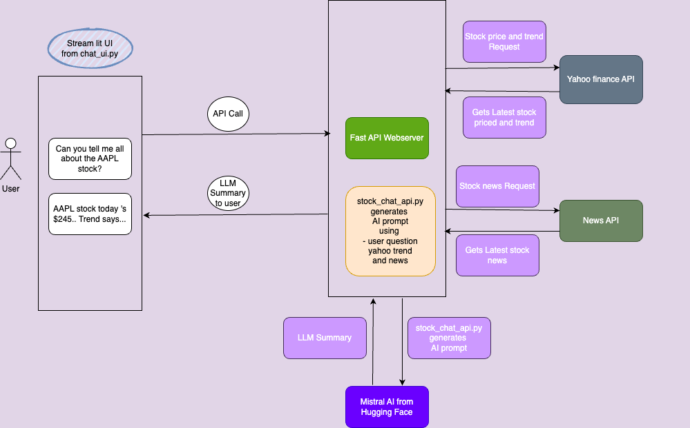

# Stock Insights AI Chatbot
## Features:

<b>AI-powered stock assistant</b>

 <b>Retreives Real-time stock prices</b>

 <b>AI-driven Stock Summaries based on stocks latest news</b>

**Stock Insights AI Chatbot** is an AI-powered stock analysis assistant that provides real-time stock prices, historical trends, AI-generated insights, and the latest financial news. Built with FastAPI, Streamlit, and Mistral AI, it allows users to interact with a smart stock advisor that understands context and follows up on previous conversations. The chatbot leverages Hugging Face’s Mistral model for deep financial analysis, Yahoo Finance (yfinance) for live stock data, and News APIs for real-time news updates. It features dynamic stock trend plotting, multi-agent communication, and fine-tuned AI models for more accurate financial insights. Whether you're a casual investor or a professional, this chatbot helps you make data-driven investment decisions. 

1) Tech Stack: FastAPI, Streamlit, Hugging Face Mistral, Yahoo Finance, Python

2) Key Features: Real-time stock updates, AI-driven insights, stock trend plotting, contextual conversations

